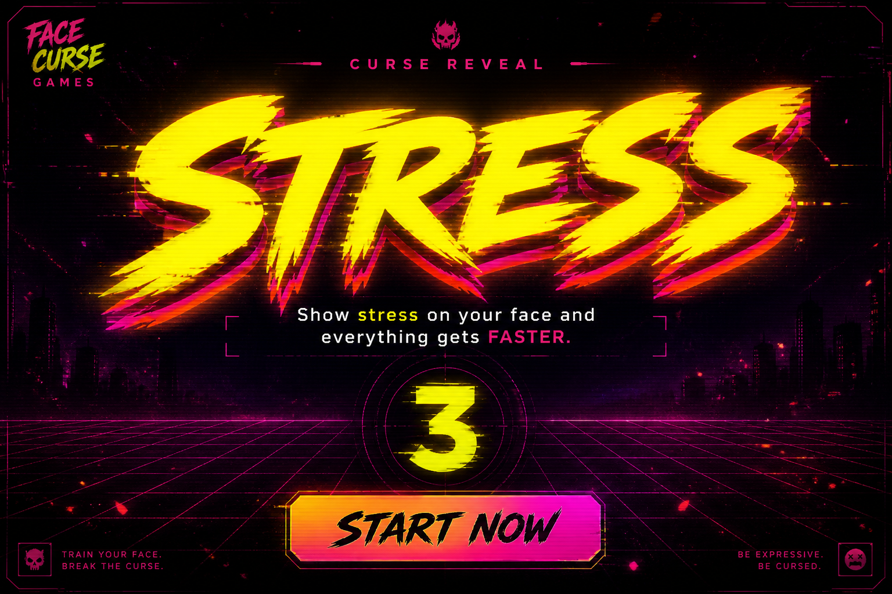
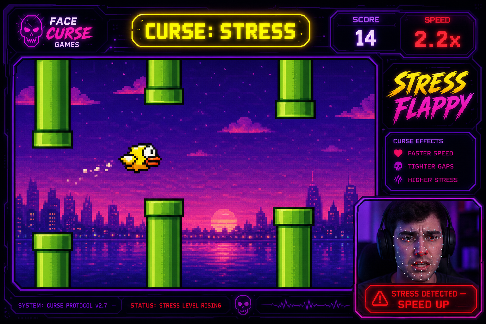
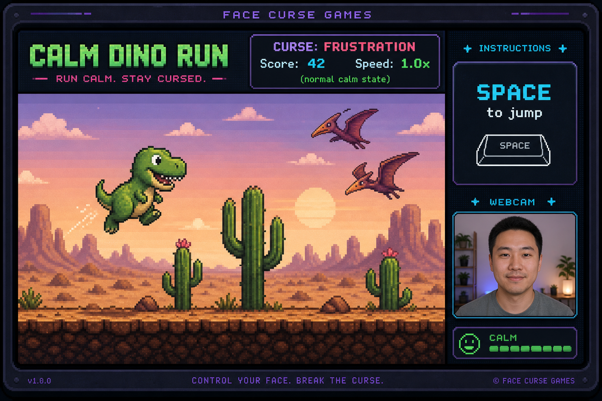

<p align="center">
  
</p>

<h1 align="center">Face Curse Games</h1>

<p align="center">
  <strong>Stay chill. Or suffer the speed.</strong><br />
  Addictive browser mini-games powered by real-time facial signal detection via the Interhuman API.
</p>

<p align="center">
  
  
  
  
  90%25-7209b7?style=for-the-badge" alt="Test Coverage" />
</p>

---

## 🎮 What is Face Curse Games?

**Face Curse Games** turns your involuntary facial reactions into a game mechanic. Before each round begins, the game reveals a random **face curse** in giant glitch typography:

- 😰 **STRESS** — Show stress on your face and everything accelerates
- 🫤 **HESITATION** — Hesitate even slightly and get punished with speed
- 😑 **DISENGAGEMENT** — Look bored or checked-out and watch the chaos multiply
- 😤 **FRUSTRATION** — Get annoyed and the game matches your energy

Using your webcam and `@interhumanai/sdk`, live audio/video feeds are processed in real-time over WebSocket. When Interhuman detects your curse signal, the game speed ramps up dynamically!

---

## 📸 Screenshots & Gameplay

<p align="center">
  
</p>

<p align="center">
  <em>The dramatic Face Curse reveal before each round.</em>
</p>

<br />

<p align="center">
  
</p>

<p align="center">
  <em><strong>Stress Flappy:</strong> As stress is detected on camera, speed surges to 2.2× while maintaining fair obstacle spacing.</em>
</p>

<br />

<p align="center">
  
</p>

<p align="center">
  <em><strong>Calm Dino Run:</strong> Keep your composure while jumping cacti and dodging pterodactyls.</em>
</p>

---

## 🕹️ Mini-Games Included

| Game | Action | Description |
| :--- | :--- | :--- |
| **Stress Flappy** | `SPACE` to flap | Flap through pipes. Stress spikes your speed, forcing razor-sharp reflexes. |
| **Calm Dino Run** | `SPACE` to jump | Jump over obstacles in an endless runner. Keep calm to maintain steady pacing. |

*Designed for zero-effort extensibility — add new mini-games in under 50 lines of code!*

---

## ⚡ Tech Stack

- **[KAPLAY](https://kaplayjs.com)** — High-performance 2D HTML5 game canvas library
- **[`@interhumanai/sdk`](https://www.npmjs.com/package/@interhumanai/sdk)** — Real-time social intelligence & emotional streaming
- **Vite** — Lightning-fast frontend build tooling
- **Express** — Secure backend for minting short-lived Interhuman client tokens
- **Vitest + V8 Coverage** — Rigorous unit and integration test suite with strict >90% coverage enforcement

---

## 🚀 Quick Start

### 1. Install & Configure

```bash
# Clone the repository
git clone https://github.com/mallochio/no-stress.git
cd no-stress

# Install dependencies
npm install

# Initialize environment configuration
npm run setup
```

### 2. Configure API Key (Optional)

Add your Interhuman API key to `.env`:

```env
INTERHUMAN_API_KEY=ih_live_your_actual_key_here
PORT=3001
```

> 💡 **Demo / Mock Mode:** Don't have an API key or webcam available? The game automatically falls back to an interactive **Mock/Demo mode**, simulating signal spikes so you can test all mechanics instantly!

### 3. Run Development Server

```bash
npm run dev
```

Open **`http://localhost:5173`** in your browser and allow camera/microphone permissions.

---

## 🚢 Single-Command Production Mode

Build and serve the complete frontend and API server from a single Express process:

```bash
npm run play
```

Open **`http://localhost:3001`**.

> 🔒 **Security Note:** In production, set `APP_ORIGIN=https://your-domain.com` in `.env` to restrict browser token minting to your verified domain.

---

## 🩺 System Diagnostics

Run the built-in diagnostic tool to check your environment, dependencies, and API credentials:

```bash
# Quick local check
npm run doctor

# Live check: verifies Interhuman API key and token minting
npm run doctor -- --live

# Comprehensive verification: tests, coverage, build, and doctor checks
npm run verify
```

---

## 🔬 How Interhuman Integration Works

```
 ┌──────────────┐       1. Request Client Token       ┌────────────────┐
 │ Browser App  ├────────────────────────────────────►│ Express Server │
 │              │◄────────────────────────────────────┤ (Mints Token)  │
 └──────┬───────┘          Short-lived Token          └────────────────┘
        │
        │ 2. Stream Audio/Video via WebSocket
        ▼
 ┌─────────────────────────┐
 │ Interhuman Streaming AI │
 └──────────┬──────────────┘
            │ 3. Push Real-time Signal Events
            │    (signal.detected, signal.updated, signal.ended)
            ▼
 ┌─────────────────────────┐
 │   SignalMonitor Class   ├────► Dynamic Speed Boost (1.0× → 2.5×)
 └─────────────────────────┘      Applied to KAPLAY Mini-Games
```

1. **Token Minting:** Browser requests a short-lived, rate-limited client token from `/api/interhuman/token`, protecting the master API key.
2. **Audio/Video Streaming:** WebRTC stream transmits to Interhuman's real-time analysis pipeline.
3. **Signal Monitoring:**
   - `signal.detected` & `signal.updated`: Multiplies game speed when matching the active curse.
   - `signal.ended`: Smoothly decays speed back to normal 1.0× baseline.
   - `engagement.updated`: Tracks disengagement metrics.
4. **Speed-Aware Spawning:** Game mechanics calculate obstacle distance based on actual elapsed velocity, ensuring faster speeds test reflexes rather than spacing out obstacles.

---

## 🧪 Testing & Code Quality

The project enforces strict code coverage thresholds (>90% lines, functions, branches, statements):

```bash
# Run unit & integration tests
npm test

# Run tests with coverage report
npm run test:coverage

# Full stack smoke test (while dev server is active)
npm run test:stack
```

---

## 🧩 Adding a New Mini-Game

Adding a new game is modular and straightforward:

1. Create `src/games/your-game.js` exporting a `MiniGameDefinition`:

```javascript
/** @type {import("./types.js").MiniGameDefinition} */
export default {
  id: "stacker",
  title: "Rage Stacker",
  description: "Drop blocks to build a tower. Stress makes the crane swing wildly!",
  actionLabel: "drop",
  width: 400,
  height: 600,
  run(ctx) {
    // Access dynamic speed boost via ctx.getSpeedBoost()
    // Report score updates via ctx.onScore(newScore)
    return {
      action() { /* Triggered on SPACE / tap */ },
      stop() { /* Cleanup timers/resources */ },
      destroy() { /* Teardown canvas */ }
    };
  },
};
```

2. Register it in `src/games/index.js`:

```javascript
import stacker from "./your-game.js";

export const miniGames = [
  flappyGame,
  dinoGame,
  stacker, // <--- Add here!
];
```

The game selection menu, curse reveal, HUD, webcam PIP, and speed boost pipeline will handle everything automatically.

---

## 📄 License

MIT © [mallochio](https://github.com/mallochio)
